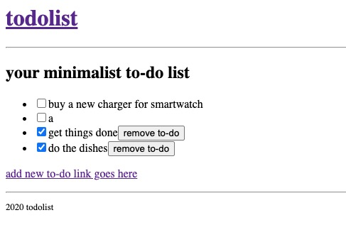

# 

## about

### intro

hello! this project was developed as an assignment for the "intro to modern frameworks" course, as part of the web
development specialization from UTFPR. the goal was to develop an MVP to-do list app using react.

I have deployed it using netlify, so you can run it locally or access it here:
[minimalisttodolist.netlify.app](https://minimalisttodolist.netlify.app). either way you should find something like
this:

### development process and decisions

after running `npx create-react-app todolist` and setting some config files, I focused on creating the components I
would like to use from the start:
- `Header`
- `Home`
- `Footer`
- `AddTodo`

once I had the first components, I introduced routes to `App.js` so the app would behave as a single page application.
for this, I used `react-router-dom` which I installed using `npm install react-router-dom`.

after this, I focused on the logics of listing, creating and removing to-dos.

my first goal was to make it work and only after that I would add style. so, at this point, the application looked
like this:

once I had everything working, I channeled my focus onto style. I got my inspiration from
[glassmorphism](https://uxdesign.cc/glassmorphism-in-user-interfaces-1f39bb1308c9), which is trending right now in UI
design - for instance, macOS Big Sur has a lot of glassmorphism in it.

this is how _minimalist todolist_ looks in its most recent version:

## project overview

this project was bootstrapped using [Create React App](https://github.com/facebook/create-react-app).

### run & build

download it using `git clone git@github.com:erikacarvalho/webdev.todolist.git`, then run `cd webdev.todolist`

#### run in development mode
in the project root directory, run `npm start` and then open [localhost:3000](http://localhost:3000)
to view it in your browser.

#### build for production
in the project root directory, run `npm run build`. this will build the app for production to the `build` folder.

-------------
📚 you can read react documentation if you'd like to learn more:
[create-react-app](https://facebook.github.io/create-react-app)
